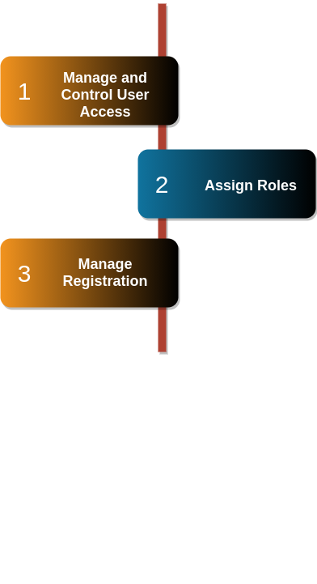

User Management
==================
User management is crucial for the efficient operation of the property management system. Property managers benefit from streamlined communication with property owners, tenants, and stakeholders, ensuring smooth coordination and maintenance handling. 

How the management works?
---------------------------
Administrators can monitor and control user access, assign roles, and manage registrations.
Overall, robust user management enhances collaboration and delivers a seamless experience for all parties involved.

