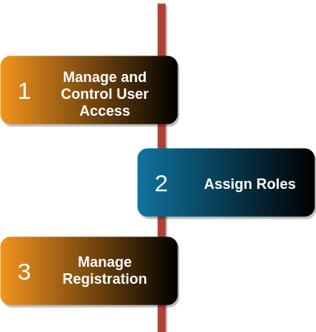
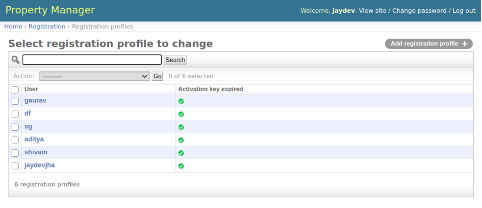
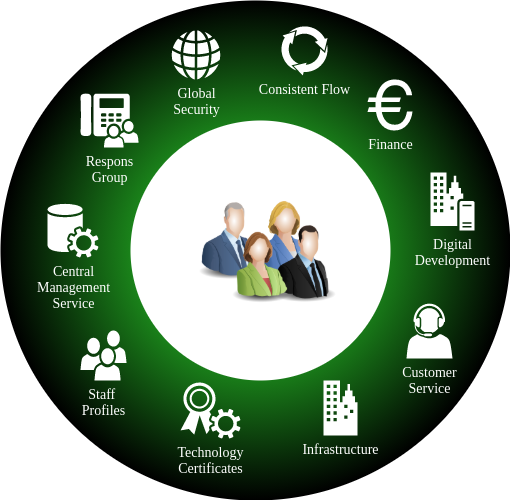

User Management
==================
User management is crucial for the efficient operation of the property management system. Property managers benefit from streamlined communication with property owners, tenants, and stakeholders, ensuring smooth coordination and maintenance handling. 

How the management works?
---------------------------
Administrators can monitor and control user access, assign roles, and manage registrations.
Overall, robust user management enhances collaboration and delivers a seamless experience for all parties involved.

Digitally Secured Environment
--------------------------------
User access and changing registration profiles by administrators play crucial roles in managing an efficient and secure digital environment. Through user access control, administrators can assign specific privileges and permissions to different individuals, ensuring that they only have access to the resources necessary for their roles. 

.. important:: 
      * This will help to
            * prevent unauthorized access
            * enhances data confidentiality

Registration Profiles
-------------------------
Additionally, administrators have the responsibility to modify registration profiles as needed, enabling them to update user information, validate credentials, and maintain accurate records. This powerful capability ensures that user data remains up-to-date and relevant, contributing to the overall integrity of the system and facilitating smooth user interactions.

Staff as a User
-----------------------
Administrators and managers play a pivotal role in overseeing the staff within the system. They are granted elevated privileges to manage staff status and maintain their profiles efficiently and securely. Various functionalities uphold by the administration is depicted below. Administrators have broad access control capabilities, allowing them to assign or revoke permissions for individual staff members based on their roles and responsibilities. This enables them to keep staff profiles *up-to-date and accurate*, facilitating effective communication and streamlined operations within the organization.

