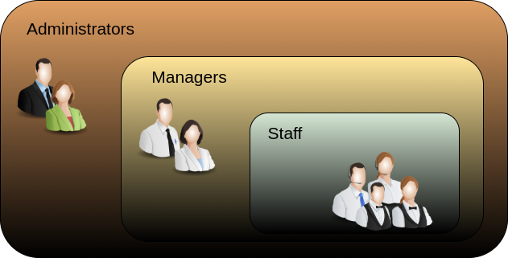

Management & Administration
==============================

1️⃣ **Efficiently handle administration and management:**  The property management system is designed to handle all aspects of administration and management in an efficient manner.

2️⃣ **User-friendly interface for property listings:** The system offers a user-friendly interface that allows administrators to manage property listings easily, ensuring accurate and up-to-date information for real-world users.

3️⃣ **Customizable website layouts:** Administrators have the flexibility to customize website layouts, providing diverse user experiences based on different device screens and window sizes.

4️⃣ **User authentication and role-based access:** The system empowers administrators to delegate responsibilities effectively by implementing user authentication and role-based access, allowing them to manage various user types within the system.

5️⃣ **Middle layer users for strategic planning:** By utilizing middle layer users, the system streamlines strategic planning and managerial activities, bridging the gap between property owners and real-world users.

6️⃣ **Adaptability for changing demands:** The system's adaptability enables administrators to modify user roles and responsibilities as needed to accommodate changing demands and requirements.

