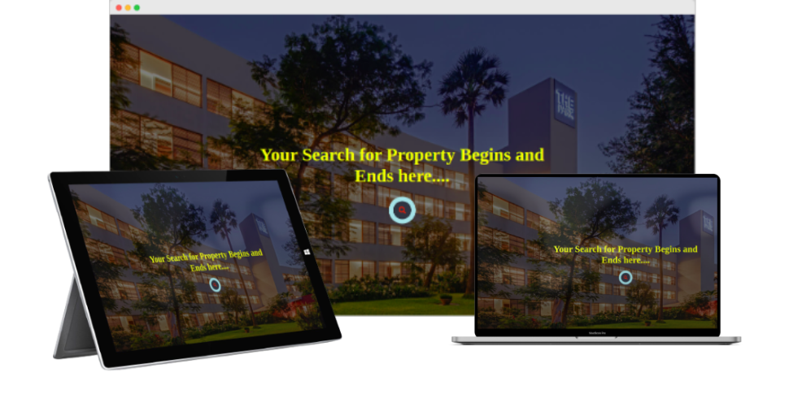
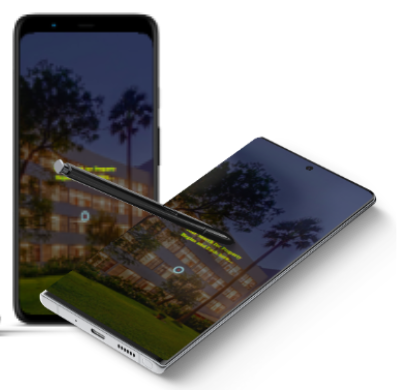

Responsive & Adaptive
========================

Responsive
------------
The system is meticulously designed to appear seamless both on computer screens 🖥️ and smartphones 🤳. Through responsive design, the web content automatically adjusts to fit different display screens and window sizes of various devices. This ensures that users have an enhanced experience and find the system simple and easy to use. Take a look at how the landing page appears on multiple devices with different sizes.

   
   
Adaptive
---------------
The system's architecture and design are intricately crafted to ensure a delightful user experience by offering multiple website layouts tailored to different device screens. This level of attention to detail allows the system to operate flawlessly on both Android and iOS devices, providing uninterrupted and versatile usage for users. Whether you are on your smartphone or computer, you can easily access and navigate through the system, making your interactions smooth and enjoyable. 

