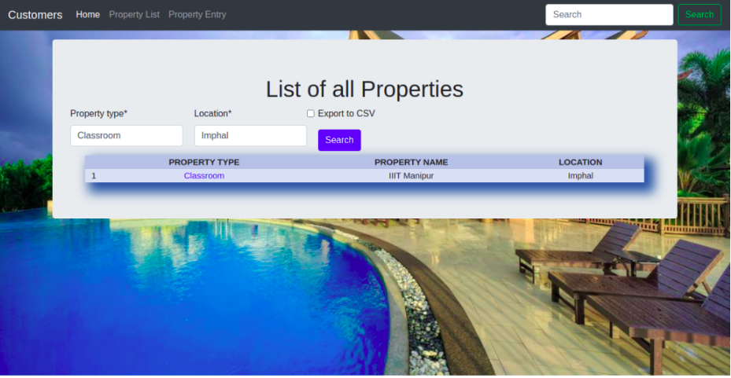
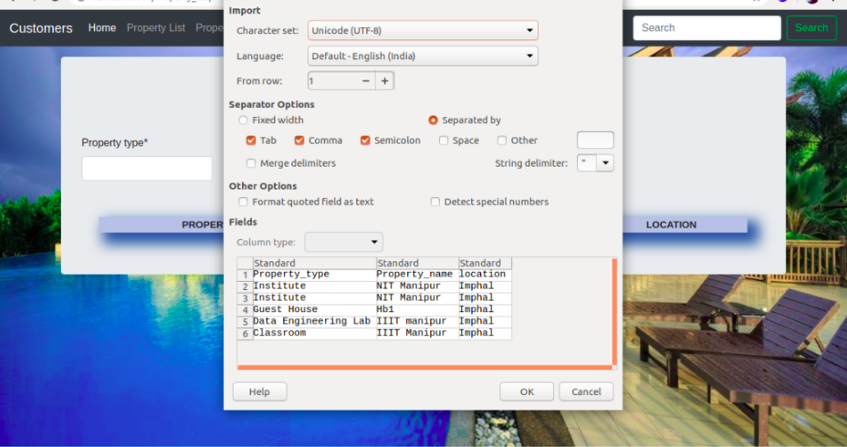

Searching And Exporting
=========================

Search
--------------
To expediate the searching process, the system offers two filters **Property type** and **Location**.

1. **Property Type:** This filter makes it easier for the user to search for the specific type of property they are searching for, such as a Home, Hotel, Hostel, or even a college classroom.

2. **Loation:** They can search the assets in their immediate area with the use of location-based filtering.

   
   
Export
-------------
If a user desires to look at all of the properties at once, they may download the entire collection of assets in excel format and then explore. This will assist customers to find out about all the different rentals available in the system and reserving them in accordance with their need.

  
