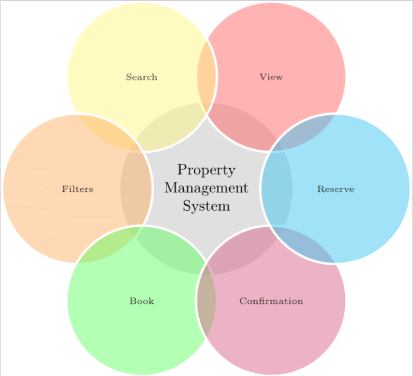

.. role:: raw-html(raw)
    :format: html

User's Perspective
=====================

   
  
Aspects
---------------
One of the major ideal benefits of the system can be shown from above, along with the numerous aspects a user anticipates from it.
It illustrates the adaptability and accessibility offered to users so they may carry out a variety of operations on the assets contained in the databases.

🤓 **View:** The users can be able to properly view the assets along with its full description in order to perform searching of the desired assets. :raw-html:` `
🔍 **Search:** This feature will allow users to search for a property from a vast list of properties in the database. :raw-html:` `
🌪️ **Filter:** This adaptability will assist the user in filtering the search by supplying some relevant details such as location and name. :raw-html:` `
✅ **Book:**  Through the booking slots and the vacancy information, access to various assets and properties can be accomplished. :raw-html:` `
✔️ **Confirm:** Before completing the final step of reserving the property, it is necessary to check for and resolve any conflicting reservations made by other parties. :raw-html:` `
🏡 **Reserve:** This is the user's final step in reserving the property based on their needs and requirements.
